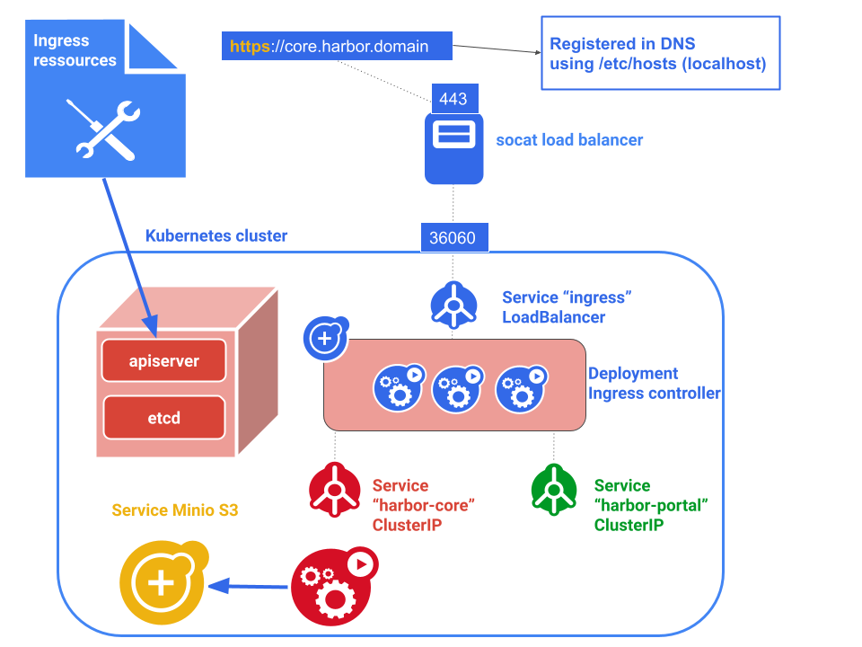

# demo-harbor

Harbor inside Kubernetes demo

Harbor is exposed through ingress (`nginx-controller`) and store image in `minio` using `s3` protocol.



## Pre-requisites

- Linux (tested on Ubuntu 224.04)
- Sudo access
- Docker (24.0.6+)
- Go (1.22.5+)
- socat
- podman (for e2e tests)

## Install the whole stack from scratch

```bash

# Install packages
sudo apt install socat podman

# Install other dependencies (kind, helm, ...)
./ignite.sh

# Bootstrap Kubernetes cluster
./prereq.sh

# Install Minio
# Install and configure nginx-controller
# Install and configure Harbor
./argocd.sh

# Configure load-balancer
./loadbalancer.sh

```


## e2e tests

```bash
# Create and push image
./push-image.sh
```

## Interactive access to S3 storage

```shell
kubectl run -it --rm s5cmd --image=peakcom/s5cmd --env AWS_ACCESS_KEY_ID=minio --env  AWS_SECRET_ACCESS_KEY=minio123 --env S3_ENDPOINT_URL=https://minio.minio:443 --command -- sh
/s5cmd --log debug --no-verify-ssl ls "s3://harbor/*"
```
